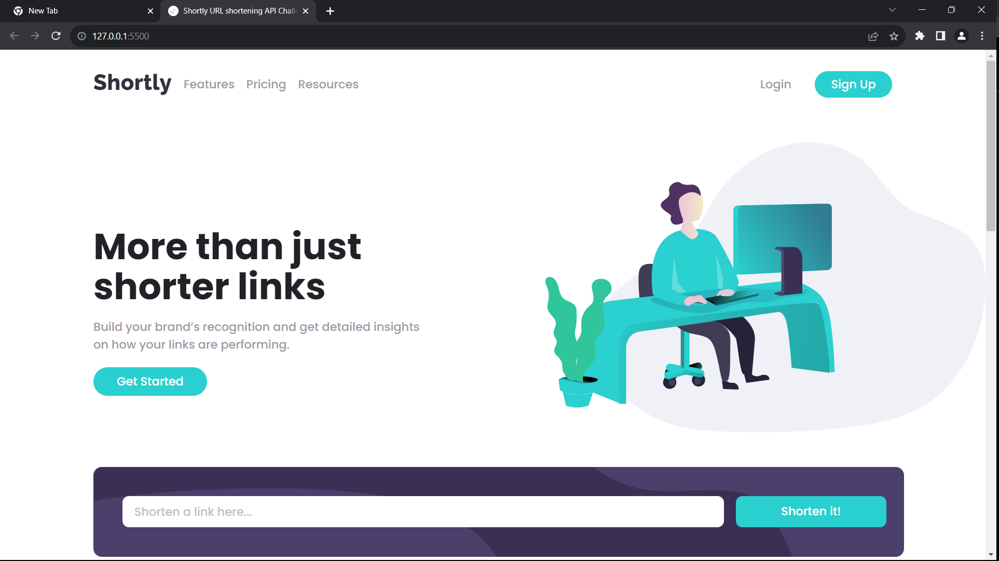

# Frontend Mentor - Shortly URL shortening API Challenge solution

This is a solution to the [Shortly URL shortening API Challenge challenge on Frontend Mentor](https://www.frontendmentor.io/challenges/url-shortening-api-landing-page-2ce3ob-G). 

## Table of contents

- [Overview](#overview)
  - [The challenge](#the-challenge)
  - [Screenshot](#screenshot)
  - [Links](#links)
- [My process](#my-process)
  - [Built with](#built-with)
  - [What I learned](#what-i-learned)
- [Author](#author)

## Overview

### The challenge

Users should be able to:

- View the optimal layout for the site depending on their device's screen size
- Shorten any valid URL
- Copy the shortened link to their clipboard in a single click
- Receive an error message when the `form` is submitted if:
  - The `input` field is empty

### Screenshot

### Links

- Solution URL: [URL](https://github.com/TJ-Shubham/url-shortening-api)
- Live Site URL: [URL](https://tj-shubham.github.io/url-shortening-api/)

## My process

### Built with

- Semantic HTML5 markup
- CSS custom properties
- Flexbox
- CSS Grid
- Mobile-first workflow
- Use media query
- JavaScript DOM
- API

### What I learned

Learn how to handle APIs and integrate them, understand the use of async functions and how they can improve the performance and use the ternary operator.

## Author

- Frontend Mentor - [TJ-Shubham](https://www.frontendmentor.io/profile/TJ-Shubham)
